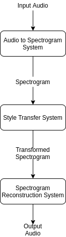

# genre-transfer-pipeline

The genre transfer pipeline system.

<p align="center">
    
</p>

## Requirements
The system has only been tested on the GNU/Linux operating system. I cannot comment on whether it works on Windows/Mac or not, though I suspect it should provided you have access to the same command-line utilities.

Requires:
* GNU Bash
* Python 3.6+
* FFmpeg
* Nvidia GPU with CUDA 10+

## Installation
All code dependencies can be installed by running the following. It's recommended to create a virtual environment before installing.
```bash
pip install -r requirements.txt
```

## Training
Training is identical to the original OSS versions of the software.

Refer to https://github.com/descriptinc/melgan-neurips for training the `spec-reconstruction` part of the pipeline. Instead of mel spectrograms, CQT spectrograms must be used. These can be created using `wav-to-spec/wav-to-cqt.py`. 

## Running
Running inference on a single 22.05kHZ piece of music can be done.

```bash
./pre-process.sh #Processes a single file to make it ready for the system
```
After pre-processing the system can be run provided there are relevant trained and saved models setup for the genre you need.
```bash
./run.sh [genre1] [genre2] #Runs the entire system, giving you the ability to perform genre transfer.
```